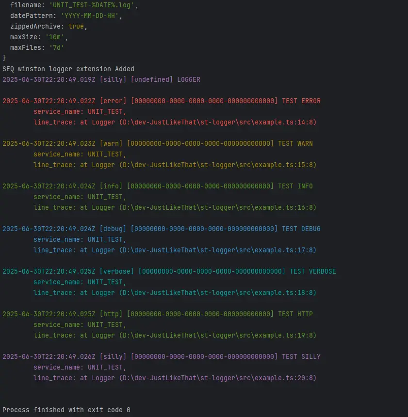

# traced-logger

A smart and versatile logger built with **winston** that supports multiple log levels, line tracing, file logging, and integrations with AWS CloudWatch and Seq. It works both in CommonJS and ES Modules environments with TypeScript support.

---

## 📦 Installation

```bash
npm install traced-logger
```

---

## 🚀 Usage Examples

### CommonJS Example (`example.cjs`)

```javascript
const { Logger, LOGGER_LEVEL } = require('traced-logger');
```

### ES Modules / TypeScript Example (`example.esm.ts`)
```typescript
import Logger, { LOGGER_LEVEL } from 'traced-logger';
```

### usage both example:

```typescript
console.log('Hello World');

DEFAULT_USE: {
    const logger = new Logger({
        serviceName: 'UNIT_TEST',
        lineTraceBack: 3, // print for each logs 3 last lines from the log call
        // transportDailyRotateFileOptions: { dirname: '../logs' },
        // transportSeqOptions: { serverUrl: 'https://localhost:5341', apiKey: 'xyz' },
        loggingModeLevel: LOGGER_LEVEL.SILLY,
        lineTraceLevels: [
            LOGGER_LEVEL.ERROR,
            LOGGER_LEVEL.WARN,
            LOGGER_LEVEL.INFO,
            LOGGER_LEVEL.DEBUG,
            LOGGER_LEVEL.HTTP,
            LOGGER_LEVEL.VERBOSE,
            LOGGER_LEVEL.SILLY,
        ],
    });

    logger.error(null, 'TEST ERROR', { message: 'TEST ERROR' });
    logger.warn(null, 'TEST WARN', { message: 'TEST WARN' });
    logger.info(null, 'TEST INFO', { message: 'TEST INFO', lineTraceBack: 2 }); // print 2 last callstack lines from the log call, instead default 3 as defined in constructor
    logger.debug(null, 'TEST DEBUG', { message: 'TEST DEBUG', lineTraceBack: 1 }); // print 1 last callstack line from the log call, instead default 3 as defined in constructor
    logger.verbose(null, 'TEST VERBOSE', { message: 'TEST VERBOSE' });
    logger.http(null, 'TEST HTTP', { message: 'TEST HTTP' });
    logger.silly(null, 'TEST SILLY', { message: 'TEST SILLY' });
}

TAG_PROPS: {
    const logger = new Logger({
        serviceName: 'UNIT_TEST',
        loggingModeLevel: LOGGER_LEVEL.SILLY,
        lineTraceLevels: [
            LOGGER_LEVEL.ERROR,
            LOGGER_LEVEL.WARN,
            LOGGER_LEVEL.INFO,
            LOGGER_LEVEL.DEBUG,
            LOGGER_LEVEL.HTTP,
            LOGGER_LEVEL.VERBOSE,
            LOGGER_LEVEL.SILLY,
        ],
        lineTraceBack: { error: 3, info: 2, warn: 3 }, // print for error,warnning level logs 3 last lines, and for info level the 2 last callstack lines, rest log level for 1 last callstack line from the log call
        tags: ['reqId', 'userId?', 'project'],
    });

    const reqId = '0000-000-000-0000';
    logger.error(reqId, 'TEST ERROR', { message: 'TEST ERROR', userId: '1111', project: 'AAA', lineTraceBack: 1 }); // print 1 last callstack lines from the log call, instead default 3 as defined in constructor
    logger.warn(reqId, 'TEST WARN', { message: 'TEST WARN', userId: '1111', project: 'AAA' });
    logger.info(reqId, 'TEST INFO', { message: 'TEST INFO', project: 'AAA' });
    logger.debug(reqId, 'TEST DEBUG', { message: 'TEST DEBUG', userId: '1111', lineTraceBack: 3 }); // print 3 last callstack lines from the log call, instead default 1 as undefined in constructor
    logger.verbose(reqId, 'TEST VERBOSE', { message: 'TEST VERBOSE', userId: '2222' });
    logger.http(reqId, 'TEST HTTP', { message: 'TEST HTTP', userId: '3333', project: 'AAA' });
    logger.silly(reqId, 'TEST SILLY', { message: 'TEST SILLY', userId: '1111' });
}
```


---


## 🔑 Key Features

- Multi-level logging with rich log levels like ERROR, WARN, INFO, DEBUG, HTTP, VERBOSE, SILLY.
- Supports line tracing for specified levels to get exact file and line info.
- Flexible tagging for logs (like requestId, userId, project).
- Console, rotating daily file logging, error file logging.
- Integration with Seq log server.
- Integration with AWS CloudWatch, optimized for Lambda.
- Runs locally or in serverless environments.
- Easily configurable via constructor options.

---

## ⚙️ Configuration Options

| Option                         | Description                                                                                     |
| ------------------------------ | ----------------------------------------------------------------------------------------------- |
| `serviceName`                  | Service name to tag logs                                                                        |
| `loggingModeLevel`             | Minimum log level to output (based on `LOGGER_LEVEL`)                                           |
| `lineTraceLevels`              | Array of levels for which to capture and attach line trace info                                 |
| `lineTraceBack`                | **New!** Configure number of stack trace lines to include per log level. Can be a single number for all levels or a record specifying the depth per log level. |
| `tags`                        | Array of tag keys to output with logs (e.g. request Id, user Id, project)                        |
| `transportConsole`            | Enable or disable console logging (default `true`)                                              |
| `transportDailyRotateFileOptions` | Options for daily rotating file logging (directory, filename pattern, max size, retention, etc.) |
| `transportDailyErrorRotateFileOptions` | Same as above but for error-level logs only                                               |
| `transportSeqOptions`         | Configuration for Seq transport (server URL, api key)                                          |
| `transportCloudWatchOptions`  | AWS CloudWatch configuration (group, stream, keys, region, retention)                          |
| `defaultMetaData`             | Default metadata to inject in all logs                                                        |
| `runLocally`                  | Flag to switch behavior for local vs serverless environments                                   |

---

## 🎯 How to Use

1. Import Logger and `LOGGER_LEVEL`.
2. Instantiate a logger with desired options.
3. Call logging methods like `.error()`, `.warn()`, `.info()`, `.debug()`, `.verbose()`, `.http()`, `.silly()`.
4. Use optional `reqId` and additional metadata as needed.
5. Logs will output to configured transports.

---

## 📖 Environment Variables Support

This logger can be configured further via environment variables such as:

- `NODE_ENV` to detect environment.
- CloudWatch and Seq credentials and URLs.
- Logging levels and line trace settings.
- Local log directory and enabling local file logging.

---


## 📊 [Seq](https://datalust.co/seq)

### Docker Compose

```yaml
version: '3.9'

volumes:
  seq-data: {}

networks:
  app-network:
    driver: bridge

services:
  admin-logger:
    image: datalust/seq:latest
    container_name: admin-logger
    environment:
      - ACCEPT_EULA=Y
      - SEQ_FIRSTRUN_ADMINUSERNAME=${LOGGING_USERNAME:-admin}
      - SEQ_FIRSTRUN_ADMINPASSWORD=${LOGGING_PASSWORD:-admin}
    volumes:
      - seq-data:/data  # Volume to persist Seq data
    ports:
      - ${LOGGING_PORT:-5341}:80
    networks:
      - app-network
```

```bash
  docker-compose up -d
```

## Seq usage

```env
    SEQ_URL=http://localhost:5341
    SEQ_API_KEY=your-api-key
```

🎥 Demo: [traced-logger SEQ connecting](https://youtu.be/5cKcnRtco44)


## 📜 License

MIT License
---

For full source and documentation, visit the repository.
