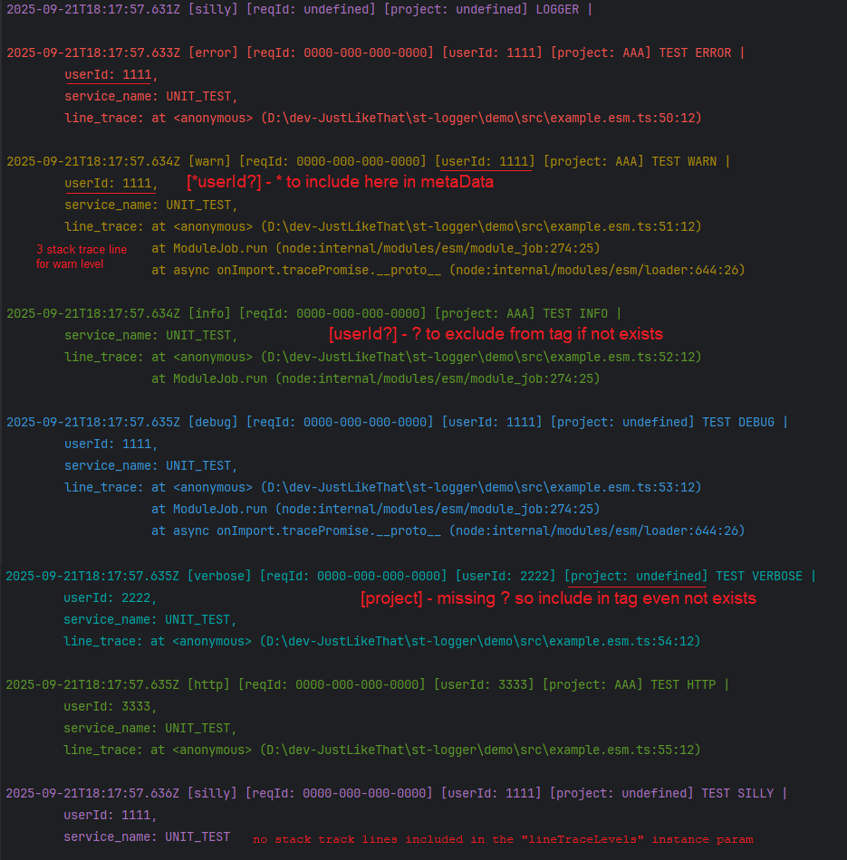

# stack-trace-logger

A smart and versatile logger built with **winston** that supports multiple log levels, line tracing, file logging, and integrations with AWS CloudWatch and Seq. It works both in CommonJS and ES Modules environments with TypeScript support.

[](https://www.npmjs.com/package/stack-trace-logger)
[](https://github.com/hdriel/stack-trace-logger)


--- 

## 📦 Installation

```bash
  npm install stack-trace-logger
```

---

## 🚀 Import supporting

### CommonJS Example (`example.cjs`)

```javascript
const { Logger, LOGGER_LEVEL } = require('stack-trace-logger');
```

### ES Modules / TypeScript Example (`example.esm.ts`)
```typescript
import Logger, { LOGGER_LEVEL } from 'stack-trace-logger';
```

## ⚙️ Configuration Options

| Option                                 | Description                                                                                                                                                                                                                                                          |
|----------------------------------------|----------------------------------------------------------------------------------------------------------------------------------------------------------------------------------------------------------------------------------------------------------------------|
| `serviceName`                          | Service name to tag logs                                                                                                                                                                                                                                             |
| `loggingModeLevel`                     | Minimum log level to output (based on `LOGGER_LEVEL`  error <  warn < info < http < verbose < debug < silly )                                                                                                                                                        |
| `lineTraceLevels`                      | Array of levels for which to capture and attach line trace info                                                                                                                                                                                                      |
| `stackTraceLines`                      | number of stack trace lines to include per log level. specifying the depth per log level.                                                                                                                                                                            |
| `tags`                                 | Array of tag keys to output with logs, e.g. [userId=123] [reqId=0000-00000-000-00] [url=/users/123].<br/> for optional tag use ? for example: tags: ['reqId', 'userId?'] <br/> to include tag as metaData start with strike for example: tags: ['reqId', '*userId?'] |
| `transportConsole`                     | Enable or disable console logging (default `true`)                                                                                                                                                                                                                   |
| `transportDailyRotateFileOptions`      | Options for daily rotating file logging (directory, filename pattern, max size, retention, etc.)                                                                                                                                                                     |
| `transportDailyErrorRotateFileOptions` | Same as above but for error-level logs only                                                                                                                                                                                                                          |
| `transportSeqOptions`                  | Configuration for Seq transport (server URL, api key)                                                                                                                                                                                                                |
| `transportCloudWatchOptions`           | AWS CloudWatch configuration (group, stream, keys, region, retention)                                                                                                                                                                                                |
| `defaultMetaData`                      | Default metadata to inject in all logs                                                                                                                                                                                                                               |
| `runLocally`                           | Flag to switch behavior for local vs serverless environments                                                                                                                                                                                                         |


### usage example

```typescript
const logger = new Logger({
    serviceName: 'UNIT_TEST',
    loggingModeLevel: LOGGER_LEVEL.SILLY,
    lineTraceLevels: [
        LOGGER_LEVEL.ERROR,
        LOGGER_LEVEL.WARN,
        LOGGER_LEVEL.INFO,
        LOGGER_LEVEL.DEBUG,
        LOGGER_LEVEL.HTTP,
        LOGGER_LEVEL.VERBOSE,
        // LOGGER_LEVEL.SILLY,
    ],
    stackTraceLines: { error: 3, info: 2, warn: 3 },
    tags: ['reqId', '*userId?', 'project'],
});

const reqId = '0000-000-000-0000';
logger.error(reqId, 'TEST ERROR', { message: 'TEST ERROR', userId: '1111', project: 'AAA', stackTraceLines: 1 });
logger.warn(reqId, 'TEST WARN', { message: 'TEST WARN', userId: '1111', project: 'AAA' });
logger.info(reqId, 'TEST INFO', { message: 'TEST INFO', project: 'AAA' });
logger.debug(reqId, 'TEST DEBUG', { message: 'TEST DEBUG', userId: '1111', stackTraceLines: 3 });
logger.verbose(reqId, 'TEST VERBOSE', { message: 'TEST VERBOSE', userId: '2222' });
logger.http(reqId, 'TEST HTTP', { message: 'TEST HTTP', userId: '3333', project: 'AAA' });
logger.silly(reqId, 'TEST SILLY', { message: 'TEST SILLY', userId: '1111' });

```


---


## 🔑 Key Features

- Multi-level logging with rich log levels like ERROR, WARN, INFO, DEBUG, HTTP, VERBOSE, SILLY.
- Supports line tracing for specified levels to get exact file and line info.
- Flexible tagging for logs (like requestId, userId, project).
- Console, rotating daily file logging, error file logging.
- Integration with Seq log server.
- Integration with AWS CloudWatch, optimized for Lambda.
- Runs locally or in serverless environments.
- Easily configurable via constructor options.

---


## 📖 Environment Variables Support

This logger can be configured further via environment variables such as:

- `NODE_ENV` to detect environment.
- CloudWatch and Seq credentials and URLs.
- Logging levels and line trace settings.
- Local log directory and enabling local file logging.

---


## 📊 [Seq](https://datalust.co/seq)

### Docker Compose

```yaml
version: '3.9'

volumes:
  seq-data: {}

networks:
  app-network:
    driver: bridge

services:
  admin-logger:
    image: datalust/seq:latest
    container_name: admin-logger
    environment:
      - ACCEPT_EULA=Y
      - SEQ_FIRSTRUN_ADMINUSERNAME=${LOGGING_USERNAME:-admin}
      - SEQ_FIRSTRUN_ADMINPASSWORD=${LOGGING_PASSWORD:-admin}
    volumes:
      - seq-data:/data  # Volume to persist Seq data
    ports:
      - ${LOGGING_PORT:-5341}:80
    networks:
      - app-network
```

```bash
  docker-compose up -d
```

## Seq usage

```env
    SEQ_URL=http://localhost:5341
    SEQ_API_KEY=your-api-key
```

```typescript
const logger = new Logger({
    serviceName: 'UNIT_TEST',
    tags: ['reqId', '*userId?', 'project'],
    loggingModeLevel: LOGGER_LEVEL.INFO,
    lineTraceLevels: [ LOGGER_LEVEL.ERROR ],
    transportSeqOptions: {
        apiKey: ENV.SEQ_API_KEY, // get from your environment variables 
        serverUrl: ENV.SEQ_SERVER_URL, // localhost: 'http://localhost:5341',
    },
});
```

🎥 Seq demo: [stack-trace-logger SEQ connecting](https://youtu.be/5cKcnRtco44)


## 📜 License

MIT License
---

For full source and documentation, visit the [repository](https://github.com/hdriel/stack-trace-logger).

